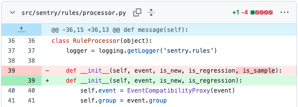

# 用户实验介绍：任务 1

## 实验环境配置

请通过以下命令配置环境，用于测试编辑结果：

```bash
conda create --name env_1 python=3.9 -y
conda activate env_1
```

## 任务介绍

Sentry 是一个开源的应用监控和错误追踪平台，帮助开发者实时发现、分析和修复生产环境中的问题。

当 Sentry 追踪开发者的代码错误时，Sentry 收到的是压缩/混淆过的代码。而当 Sentry 遇到代码错误并需要追踪错误发生的位置时，需要获取原始源代码。因此
Sentry 在 `src/sentry/lang/javascript/processor.py` 中定义了函数 `fetch_url`，该函数负责根据给定的 URL，从网络下载缺失的源文件。

现在出于安全和合规的考虑，Sentry 团队决定默认不允许从网络下载缺失的源文件，而使用本地现有的文件。因此在 `fetch_url` 函数中，添加如下编辑：


你可以前往 [`src/sentry/lang/javascript/processor.py`](src/sentry/lang/javascript/processor.py)，复制以下内容完成该初始修改：

```python
    elif not allow_scraping:
        error = {
            'type': EventError.JS_MISSING_SOURCE,
            'url': url,
        }
        raise CannotFetchSource(error)
```

其中，`allow_scraping` 是一个**尚待定义、布尔类型、默认为 False 的函数变量**。该函数的作用是判断是否允许从网络下载缺失的源文件。

请你在完成该初始修改后，找到所有受到该编辑影响的位置，并完成后续修改。

> ⚠️ **温馨提示**
>
> * **初始编辑包含在内**，一共需要完成 **8** 处修改
>
> * 所有的修改都不需要新增/删除/重命名任何文件
>
> * 你可以在项目根目录下运行 `python count.py` 来查看和统计已经完成的编辑数量
>
> * 编辑数量**仅供参考**，请根据[验证修改](#验证修改)来判断是否完成修改目标

## 编辑描述

当你需要输入编辑描述时，你可以直接复制以下内容：

```bash
Ensure releases can be used when scraping is disabled
```

如果你所在的实验组使用的后端模型是 Claude Code，你可以输入任意内容和 Claude Code 沟通。

## 验证修改

请运行一下命令验证修改是否成功

```bash
python -m test.run
```

当修改正确时，你应该看到以下内容：

```bash
Test 1 passed.
Test 2 passed.
Test 3 passed.
Test 4 passed.
```

恭喜你成功完成该任务，请你：

1. 点击右上角的保存按钮，保存你的活动记录（保存为当前文件夹下的`{用户id}-1-{你所在的组别}.json`，例如`a94c-1-A.json`）
2. 停止录屏
3. 告知实验负责人

在完成**所有任务后**，请打包每个任务的 `{用户id}-1-{你所在的组别}.json` 文件和 录屏文件，提交给实验负责人。
